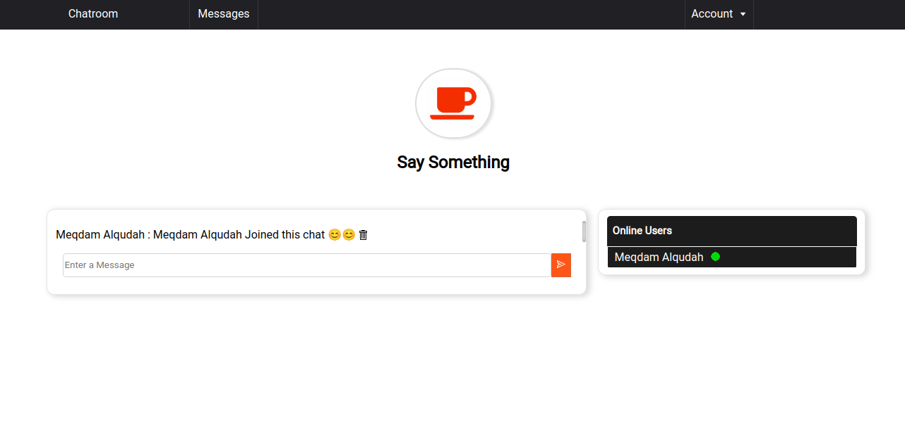
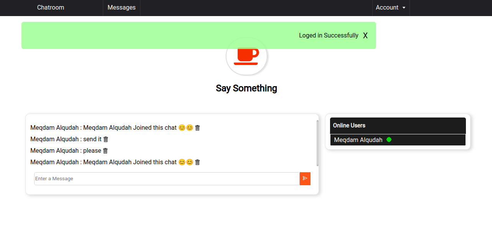
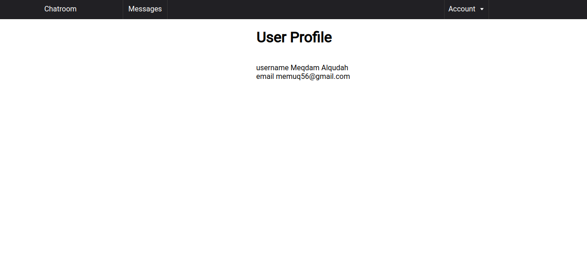
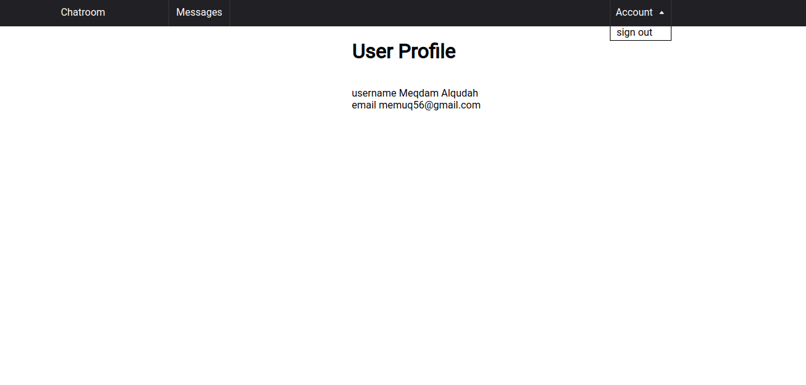
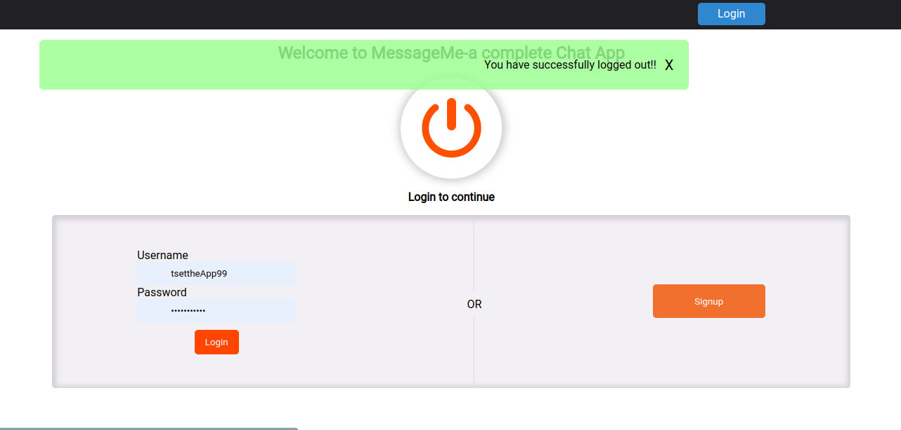
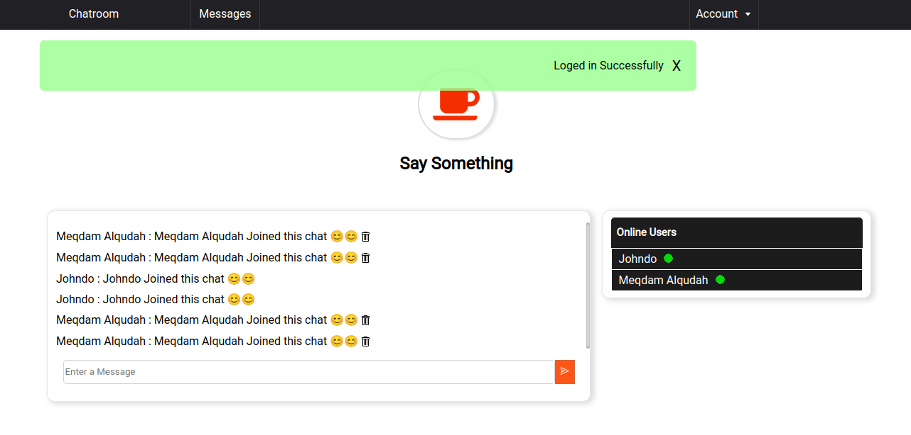

# MessageMeApp

## Built With

- ruby on rails
- react.js
- redux

## Video demo
-[Video demo](https://www.loom.com/share/f54a646d8a994914a7e3bd44fec3f6de)
## Deployed version

  [link](https://mysite-s43s.onrender.com/login)

### Prerequisites

Chrome or any explorer
## Get started 
  if you just want to test the app you can use Johndo as a username and (12345654321) as a password
## Authors

👤 **Meqdam Al-qudah**

- [GitHub](https://github.com/MeqdamAlqudah)
- [Twitter](https://twitter.com/MeqdamQudah)
- [LinkedIn](https://www.linkedin.com/in/meqdam-alqudah/)
